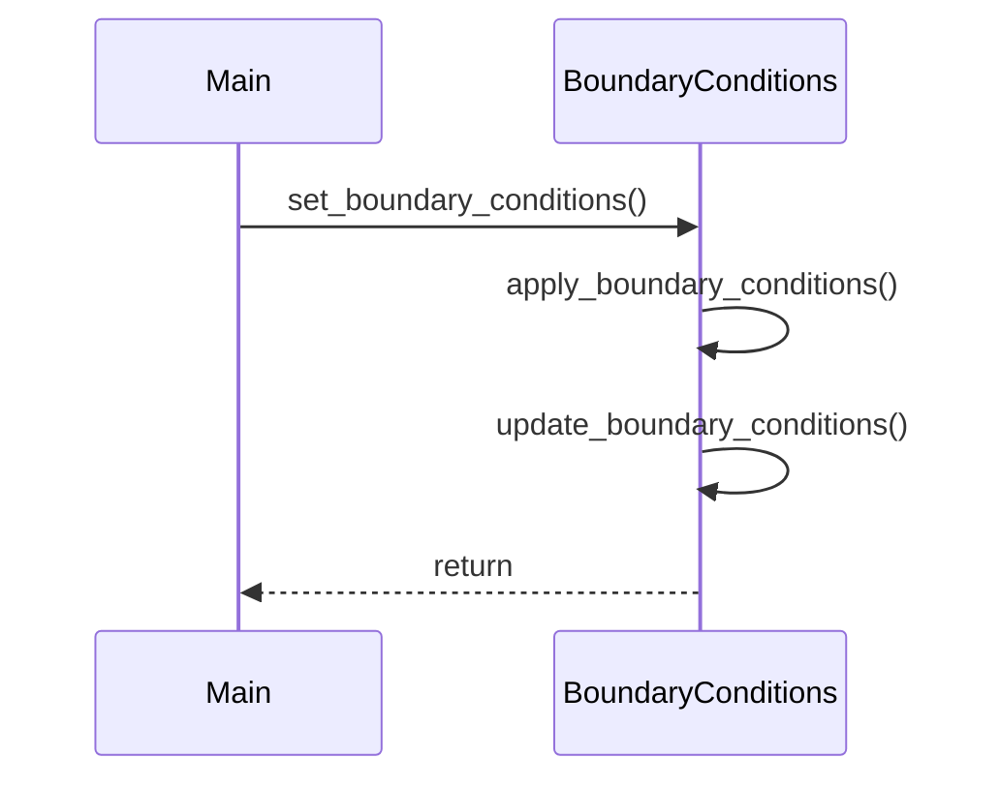

```mermaid
sequenceDiagram
    participant Main
    participant BoundaryConditions
    Main->>BoundaryConditions: set_boundary_conditions()
    BoundaryConditions->>BoundaryConditions: apply_boundary_conditions()
    BoundaryConditions->>BoundaryConditions: update_boundary_conditions()
    BoundaryConditions-->>Main: return

```